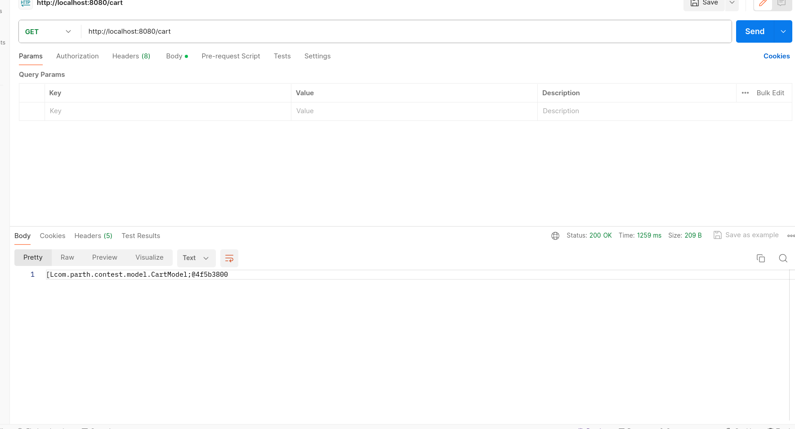
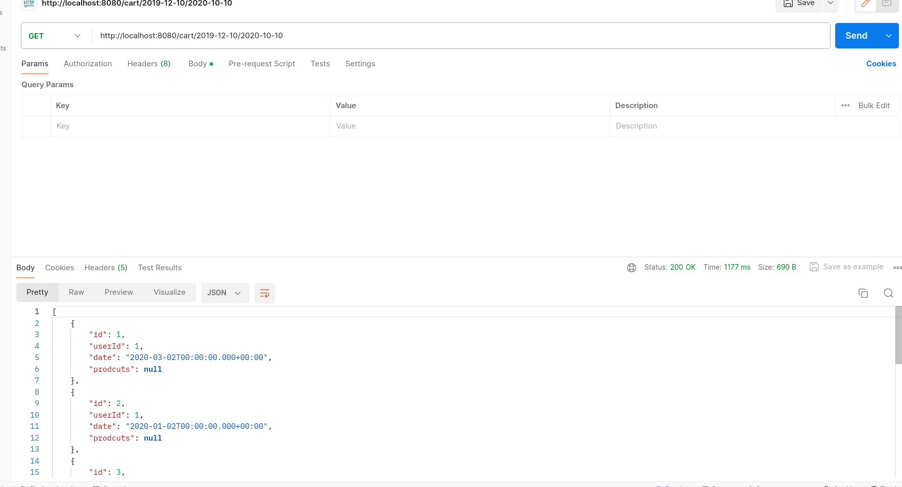
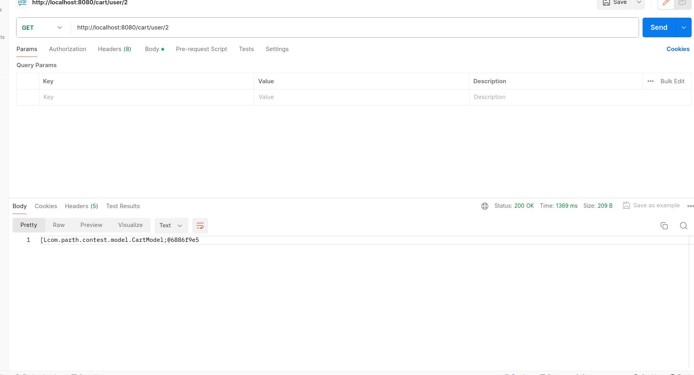
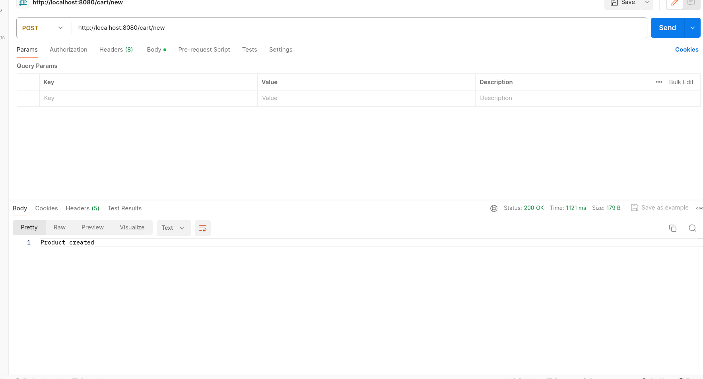
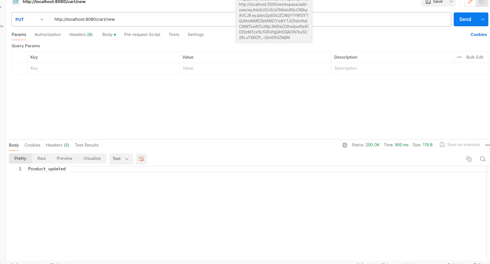

Sure, here's a clear documentation of the API endpoints along with setup instructions:

### API Endpoints Documentation

#### 1. Get all carts
- **URL:** `/cart`
- **Method:** GET
- **Description:** Retrieves all carts.
- **Response:** JSON array of CartModel objects representing all carts.

- 
#### 2. Get a single cart
- **URL:** `/cart/{id}`
- **Method:** GET
- **Description:** Retrieves a single cart by its ID.
- **Parameters:**
    - `{id}`: Integer - ID of the cart to retrieve.
- **Response:** JSON object representing the specified cart.

- 
#### 3. Get carts in date range
- **URL:** `/cart/{start}/{end}`
- **Method:** GET
- **Description:** Retrieves all carts within a specified date range.
- **Parameters:**
    - `{start}`: String - Start date of the range (format: YYYY-MM-DD).
    - `{end}`: String - End date of the range (format: YYYY-MM-DD).
- **Response:** JSON array of CartModel objects representing carts within the specified date range.

- 
#### 4. Get user's carts
- **URL:** `/cart/user/{name}`
- **Method:** GET
- **Description:** Retrieves all carts of a specified user.
- **Parameters:**
    - `{name}`: Integer - User's ID.
- **Response:** JSON array of CartModel objects representing carts of the specified user.

#### 5. Add new cart
- **URL:** `/cart/new`
- **Method:** POST
- **Description:** Adds a new cart.
- **Request Body:** JSON object representing the new cart (CartModel).
- **Response:** Success message indicating the cart creation.

#### 6. Update a cart
- **URL:** `/cart/{id}`
- **Method:** PUT
- **Description:** Updates an existing cart.
- **Parameters:**
    - `{id}`: Integer - ID of the cart to update.
- **Request Body:** JSON object representing the updated cart (CartModel).
- **Response:** Success message indicating the cart update.

- 
#### 7. Delete a cart
- **URL:** `/cart/{id}`
- **Method:** DELETE
- **Description:** Deletes an existing cart.
- **Parameters:**
    - `{id}`: Integer - ID of the cart to delete.
- **Response:** Success message indicating the cart deletion.

### Setup Instructions

1. **Clone the repository**: Clone the project repository containing the REST API code.

2. **Build the project**: Use Maven or Gradle to build the project.

3. **Set up database**: Ensure that you have a database configured and modify the database configuration in the application accordingly.

4. **Run the application**: Run the application using an IDE or command-line interface.

5. **Test the endpoints**: Use tools like Postman or cURL to test the API endpoints mentioned above.

6. **Optional: Authentication/Authorization**: Implement authentication and authorization mechanisms if required for your application.

By following these setup instructions, you should be able to deploy and use the provided REST API endpoints effectively.